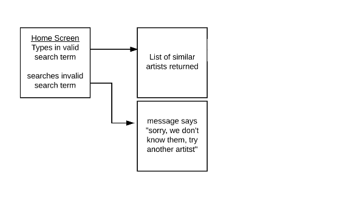
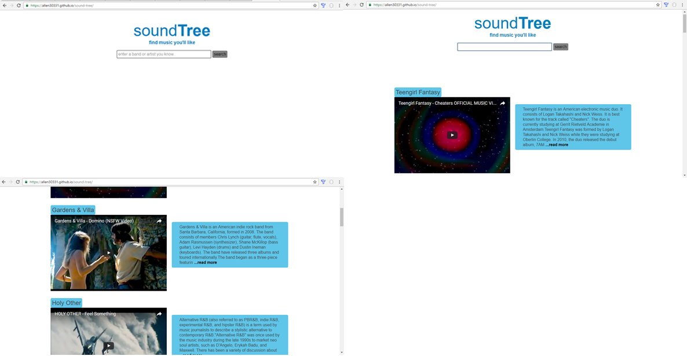

# Soundtree

> [Soundtree](https://allen30331.github.io/sound-tree/) is a music recommendation app, designed to suggest music based on music the user already likes.  

# Summary

> There is so much music available now, that it's hard to discover new music that you actually like. Soundtree makes the discovery of new music easy by using [Tastekid's](https://www.tastekid.com/) api. The user gets music recommendations based on their input.

# Technology

* HTML
* CSS
* Javascript
* JQuery

# User Flow

> 

# Screenshots

> 